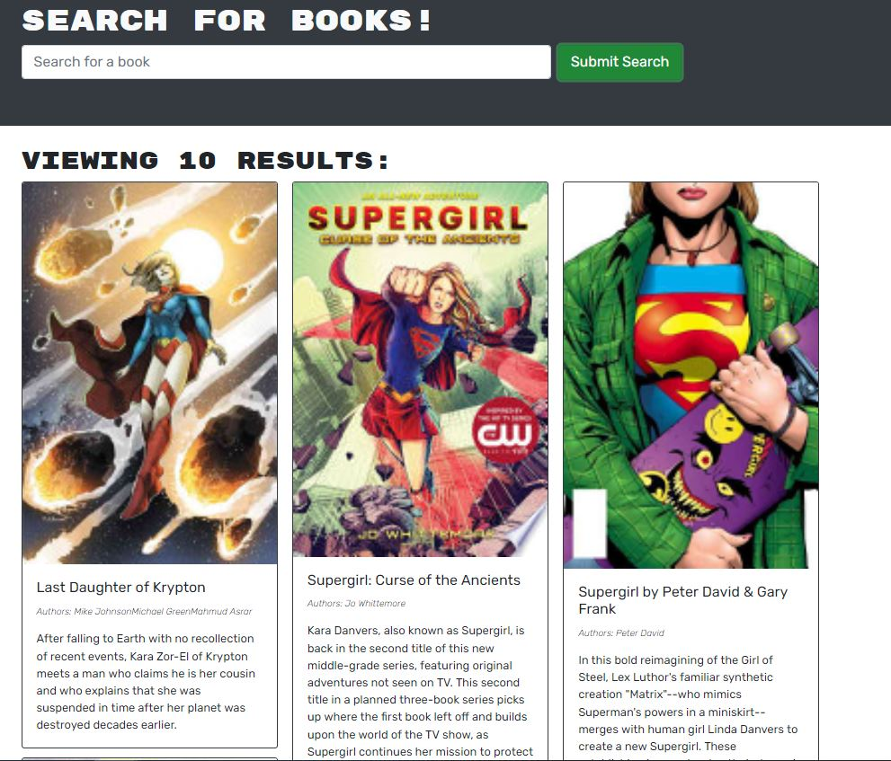
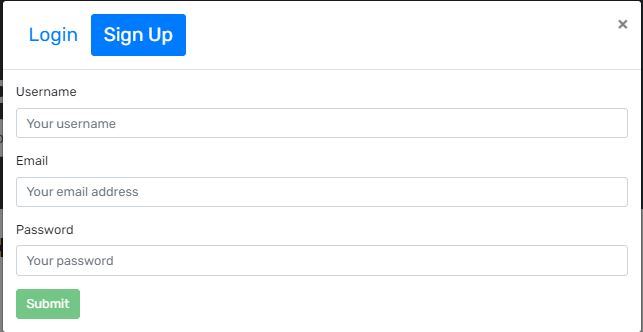
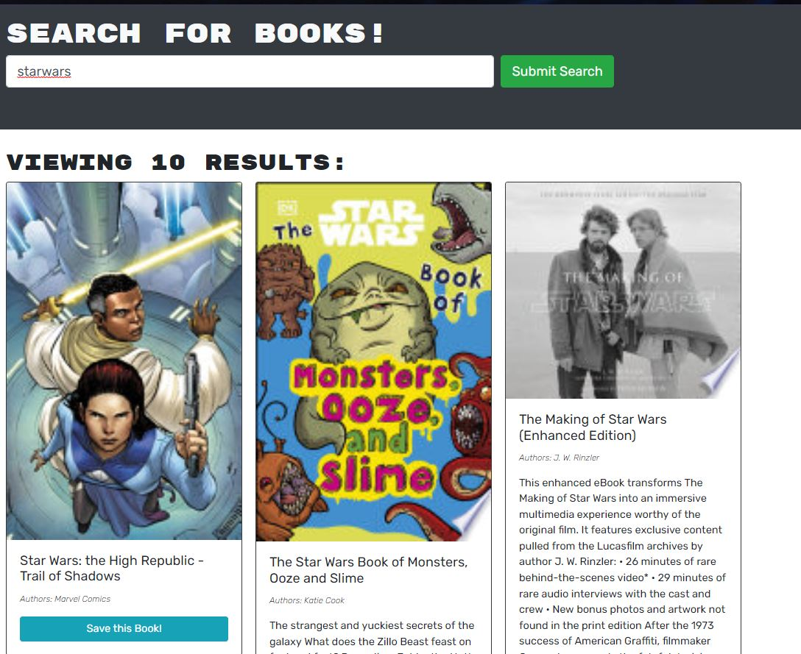
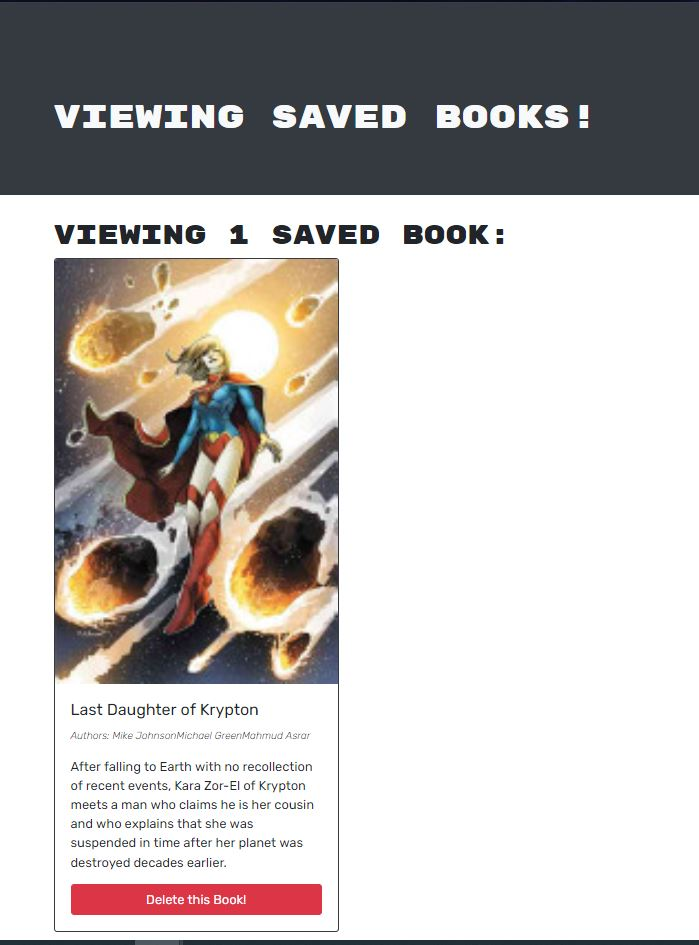

# Professional Portfolio

## Description

My Portfolio using react.js

Repo: https://github.com/andrewyu22/google-book-search

Link: https://guarded-lowlands-35603.herokuapp.com/

## Table of Contents

- [Installation](#installation)
- [Usage](#usage)
- [License](#license)
- [Contributing](#contributing)
- [Tests](#tests)
- [Questions](#questions)

---

## Installation

### "npm install" on the root directory to install all dependency in client & server folder

## Usage

### Homepage (Not Login)

### Sign up or Log in

### Login (You will be able to see a Save Button)

### See your Books that you saved

### Contact Me

## License

No Licenses for this project!

---

## Contributing

No contribution information for this project!

---

## Tests

No test for this project!

---

## Questions

Link to Github: https://github.com/andrewyu22

If you have any further questions, please contact me at andrewyu2654@gmail.com
